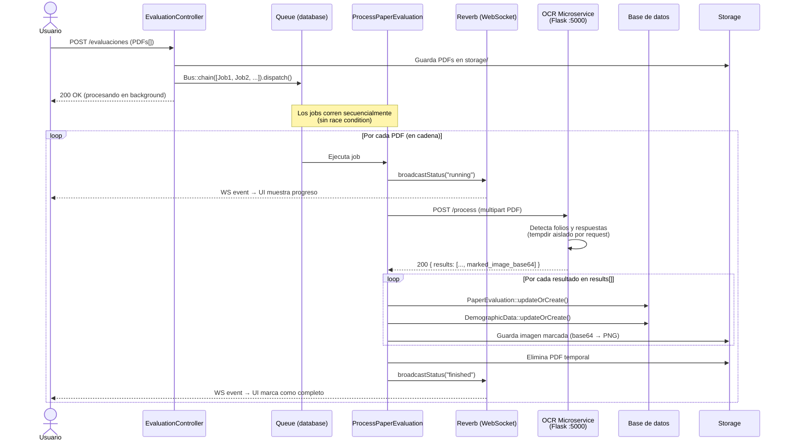

# Migración OCR: docker exec → HTTP API

Migrar la integración con el microservicio Python de `docker exec` + polling de archivos
a una API HTTP con Flask, eliminando el race condition y el acoplamiento al socket Docker.

---

## Estado actual (referencia)

```
Laravel Job → docker cp {pdf} → docker exec python main.py → polling docker/output/*.json
```

## Estado objetivo

```
Laravel Job → POST http://ocr-service:5000/process → JSON response directa
```

## Diagrama del flujo nuevo



### Manejo de errores

```mermaid
flowchart TD
    A[Job inicia] --> B{POST /process}
    B -->|HTTP 200| C[Procesar results[]]
    B -->|HTTP 4xx/5xx| D[Lanza RuntimeException]
    D --> E[Job falla → entra a failed_jobs]
    C --> F{¿Folio válido?}
    F -->|Sí| G[PaperEvaluation::updateOrCreate]
    F -->|No| H[Log warning + skip]
    G --> I[broadcastStatus finished]
    H --> I
    E --> J[broadcastStatus failed con try/catch]
```

---

## TODO List

### 🐍 Python / Microservicio

- [ ] **Crear `app.py` (Flask server)** — punto de entrada HTTP que reemplaza la ejecución directa de `main.py`
  - Endpoint `POST /process` que recibe un PDF como `multipart/form-data`
  - Devuelve JSON: `{ "results": [{ "folio": "...", "answers": {...} }] }`
  - Respuestas de error estructuradas: `{ "error": "...", "detail": "..." }` con HTTP 4xx/5xx

- [ ] **Refactorizar `main.py` a funciones importables**
  - Extraer la lógica de procesamiento en una función `process_pdf(pdf_bytes) -> list[dict]`
  - Eliminar las llamadas a `limpiar_carpeta()` globales del nivel de módulo (ahora cada request trabaja en un directorio temporal aislado)
  - Cada request debe usar `tempfile.mkdtemp()` como directorio de trabajo — no paths compartidos

- [ ] **Manejo de directorios por-request**
  - Reemplazar paths fijos (`/app/input/`, `/app/output/`) por directorios temporales generados por request
  - Limpiar el directorio temporal al finalizar cada request (éxito o error)

- [ ] **Actualizar `Dockerfile`**
  - Cambiar `CMD` a `CMD ["python", "app.py"]` (o `flask run --host=0.0.0.0 --port=5000`)
  - El CMD actual está comentado — habilitarlo con el nuevo entry point

- [ ] **Actualizar `requirements.txt`**
  - Flask ya está incluido ✓
  - Agregar `werkzeug` si no viene implícito con Flask (verificar versión)

- [ ] **Health check endpoint**
  - `GET /health` → `{ "status": "ok" }` para que Laravel pueda verificar disponibilidad

---

### 🐘 Laravel

#### Configuración

- [x] **Agregar URL del servicio OCR a `config/services.php`**
  ```php
  'ocr' => [
      'url' => env('OCR_SERVICE_URL', 'http://localhost:5000'),
      'timeout' => env('OCR_SERVICE_TIMEOUT', 300),
  ],
  ```

- [x] **Agregar variable al `.env` y `.env.example`**
  ```
  OCR_SERVICE_URL=http://localhost:5000
  OCR_SERVICE_TIMEOUT=300
  ```

#### Job `ProcessPaperEvaluation`

- [x] **Eliminar `copyPdfToContainer()`** — ya no se usa `docker cp`

- [x] **Eliminar `executeOcrProcessing()`** — ya no se usa `docker exec`

- [x] **Eliminar `processJsonResults()`** — ya no hay polling de archivos JSON en disco

- [x] **Eliminar `cleanupFiles()`** — el microservicio maneja su propio cleanup; solo eliminar el PDF subido por el usuario desde `storage/`

- [x] **Reemplazar los 3 métodos anteriores por `callOcrService()`**
  - Usa `Http::timeout()->attach()->post()` para enviar el PDF
  - Recibe el JSON de respuesta directamente
  - Lanza excepción con mensaje claro si el servicio retorna error HTTP

- [x] **Reemplazar `processJsonFile()` por `processOcrResult(array $result)`**
  - Recibe el array ya parseado desde la respuesta HTTP (no lee archivos del disco)
  - Lógica de `PaperEvaluation::updateOrCreate()`, demografía, etc. se mantiene igual

- [x] **Eliminar el constructor `$containerName`** — ya no es necesario

- [x] **Reducir `$timeout`** — de 3600s a 300s

- [x] **Agregar `try/catch` alrededor de `broadcastStatus()`** — aislar fallos de Reverb del resultado del job

#### Controller `EvaluationController`

- [x] **Eliminar el parámetro `$containerName` al crear el job**
  ```php
  // Antes
  new ProcessPaperEvaluation($fullPath, $containerName, $userId, ...)
  // Después
  new ProcessPaperEvaluation($fullPath, $userId, ...)
  ```

- [x] **Encadenar jobs con `Bus::chain()`** en lugar de `foreach dispatch()`
  ```php
  // Antes
  foreach ($jobs as $job) { dispatch($job); }
  // Después
  Bus::chain($jobs)->dispatch();
  ```
  Esto garantiza que un PDF termine antes de que empiece el siguiente,
  eliminando el race condition residual durante el período de transición.

#### Tests

- [x] **Crear/actualizar test para `ProcessPaperEvaluation`**
  - Mockear `Http::fake()` con respuesta exitosa del servicio OCR
  - Verificar que `PaperEvaluation` se crea correctamente

- [x] **Test de error del servicio OCR**
  - `Http::fake()` con respuesta 500
  - Verificar que el job lanza excepción

---

## Contrato de la API OCR

### `POST /process`

**Request:**
```
Content-Type: multipart/form-data
Body: file=<pdf_binary>
```

**Response 200:**
```json
{
  "results": [
    {
      "folio": "060310001",
      "evaluation_type": "likert",
      "evaluation_type_code": "06",
      "answers": { ... },
      "marked_image_base64": "..."
    }
  ]
}
```

**Response 422 (folio inválido o PDF ilegible):**
```json
{
  "error": "No se pudo detectar folio válido",
  "detail": "El PDF no contiene páginas con marcadores reconocibles"
}
```

**Response 500 (error interno OCR):**
```json
{
  "error": "Error durante el procesamiento OCR",
  "detail": "..."
}
```

### `GET /health`
```json
{ "status": "ok", "version": "1.0" }
```

---

## Notas de transición

- La lógica de `extractStructuredData()`, `saveDemographicData()`, y todos los métodos `normalize*()` en el job **no cambian** — solo cambia de dónde viene el input (archivo vs. HTTP response).
- La imagen marcada (`output_with_markers/`) puede devolverse como base64 en la respuesta o guardarse en un endpoint separado `GET /marked-image/{folio}`.
- El `docker-compose.yml` ya tiene el puerto 5000 mapeado ✓ — no requiere cambios.
