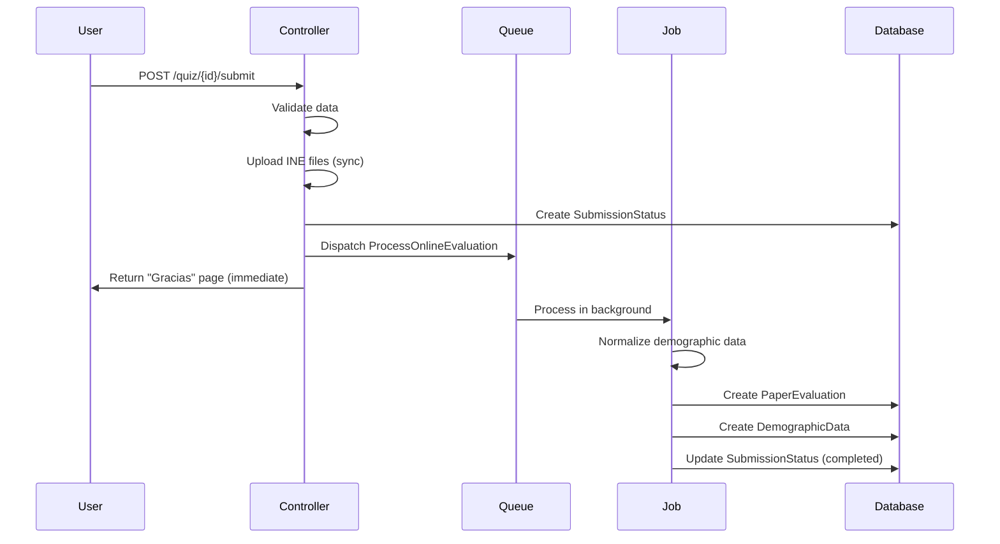

# Online Quiz Submission Flow

## Overview

The online quiz submission system has been refactored to use asynchronous job-based processing. This document describes the architecture, data flow, and key components of the new system.

## Architecture

```
User Submit → Controller (sync) → SubmissionStatus Created → Job Dispatched (async)
                                                                      ↓
                                          PaperEvaluation Created ← Job Processing
                                                  ↓
                                          DemographicData Created
```

### Key Principles

1. **Immediate User Response**: Users see "Gracias" page immediately after submission
2. **Async Processing**: Heavy processing happens in background via queue
3. **No Broadcasting**: No real-time updates needed (users are external)
4. **Normalized Data**: All demographic data normalized via shared service

## Flow Diagram



## Components

### 1. QuizController::submit()

**Location**: [app/Http/Controllers/QuizController.php](../app/Http/Controllers/QuizController.php)

**Responsibilities**:
- Validate incoming quiz data
- Generate folio for evaluation
- Upload INE files synchronously to storage
- Create `SubmissionStatus` record with complete data snapshot
- Dispatch `ProcessOnlineEvaluation` job to queue
- Return immediate "Gracias" response to user

**Key Changes from Old Implementation**:
- ❌ No longer creates `PaperEvaluation` synchronously
- ❌ No longer creates `DemographicData` directly
- ✅ Creates `SubmissionStatus` for tracking
- ✅ Dispatches async job for processing
- ✅ Returns immediate response (no waiting)

### 2. ProcessOnlineEvaluation Job

**Location**: [app/Jobs/ProcessOnlineEvaluation.php](../app/Jobs/ProcessOnlineEvaluation.php)

**Queue**: `quiz_processing`

**Timeout**: 300 seconds (5 minutes)

**Max Retries**: 3 attempts with progressive delay

**Responsibilities**:
1. Find `SubmissionStatus` by ID
2. Mark status as "processing"
3. Create `PaperEvaluation` with extracted data
4. Create `DemographicData` using normalization service
5. Mark status as "completed"
6. Handle errors with retry logic

**Error Handling**:
```php
try {
    // Processing...
} catch (\Exception $e) {
    $submissionStatus->markAsFailed($e->getMessage());
    
    if ($submissionStatus->canRetry()) {
        $delay = ($submissionStatus->retry_count + 1) * 60; // Progressive delay
        self::dispatch($submissionStatusId)->delay(now()->addSeconds($delay));
    }
    
    throw $e;
}
```

### 3. DemographicDataNormalizationService

**Location**: [app/Services/DemographicDataNormalizationService.php](../app/Services/DemographicDataNormalizationService.php)

**Purpose**: Normalize demographic data from various sources (online, OCR, Likert)

**Key Methods**:
- `extractDemographicInfo()` - Main entry point
- `normalizeContractType()` - Normalize contract types
- `normalizePositionType()` - Normalize positions (handles numeric indices)
- `normalizeDepartmentType()` - Normalize departments
- `convertAgeToRange()` - Convert numeric age to range format
- 12+ other normalization methods

### 4. DemographicDataService

**Location**: [app/Services/DemographicDataService.php](../app/Services/DemographicDataService.php)

**Purpose**: Create/update `DemographicData` records

**Key Methods**:
```php
public function updateOrCreate(
    PaperEvaluation $paperEvaluation,
    array $rawDemographicData
): DemographicData
```

**Pattern**: Delete existing → Normalize → Create new (matches OMR pattern)

## Data Structures

### SubmissionStatus.data_snapshot

Stores complete quiz submission before processing:

```json
{
  "evaluation_type": "referencia_v",
  "referencia_iii": {
    "q1": "A",
    "q2": "B",
    "acontecimientos_traumaticos": { "0": true }
  },
  "referencia_i": { "0": true },
  "referencia_v": {
    "sexo": "Masculino",
    "edad": "35",
    "datos_laborales": {
      "ocupacion_puesto": "Supervisor",
      "tipo_puesto": "Mandos medios",
      "tipo_contratacion": "Base",
      "tipo_personal": "Sindicalizado",
      "rotacion_turnos": "No",
      "experiencia": {
        "tiempo_puesto_actual": "1-4 años",
        "tiempo_experiencia_laboral": "5-9 años"
      }
    },
    "ine_frente": "quiz_submissions/org-uuid/folio/file.jpg"
  },
  "custom_fields": {
    "field_1": "value"
  },
  "organization_info": {
    "nombre_comercial": "Planta Norte",
    "division_sucursal": "Producción",
    "estado": "Nuevo León",
    "ciudad": "Monterrey"
  },
  "quiz_name": "Evaluación Q1 2026",
  "quiz_type": "normal",
  "submitted_at": "2026-01-22T10:30:00Z",
  "submission_ip": "192.168.1.100",
  "user_agent": "Mozilla/5.0..."
}
```

### PaperEvaluation.raw_data

Standardized structure following [ONLINE_RAW_DATA_SCHEMA.md](ONLINE_RAW_DATA_SCHEMA.md):

```json
{
  "source": "online",
  "source_metadata": {
    "quiz_id": 123,
    "quiz_name": "Evaluación Q1 2026",
    "quiz_type": "normal",
    "submitted_at": "2026-01-22T10:30:00Z",
    "submission_ip": "192.168.1.100",
    "user_agent": "Mozilla/5.0...",
    "organization_info": {
      "nombre_comercial": "Planta Norte",
      "division_sucursal": "Producción",
      "estado": "Nuevo León",
      "ciudad": "Monterrey"
    }
  },
  "custom_fields": {
    "field_1": "value"
  },
  "file_uploads": {
    "ine_frente": "quiz_submissions/org-uuid/folio/ine_frente.jpg",
    "ine_reverso": "quiz_submissions/org-uuid/folio/ine_reverso.jpg"
  }
}
```

## Folio Generation

Format: `XXYYYZZZZZ` (9 digits)
- `XX` = Evaluation type code (02=Referencia III, 03=Referencia V, 04=Cisneros)
- `YYY` = Organization code (3 digits)
- `ZZZZ` = Personal folio (4 digits, incremental per organization)

Example: `030010001`
- `03` = Referencia V (full evaluation)
- `001` = Organization code
- `0001` = First evaluation for this organization

## Database Tables

### submission_statuses

Tracks async processing state:

| Column | Type | Description |
|--------|------|-------------|
| id | bigint | Primary key |
| folio | string(9) | Generated folio |
| personal_id | string(4) | Personal identifier |
| organization_id | uuid | Organization FK |
| quiz_id | bigint | Quiz FK |
| status | enum | pending/processing/completed/failed |
| data_snapshot | json | Complete submission data |
| error_message | text | Error if failed |
| processed_at | timestamp | When completed |
| retry_count | integer | Number of retries |

### paper_evaluations

Stores processed evaluation:

| Column | Type | Description |
|--------|------|-------------|
| id | uuid | Primary key |
| folio | string(9) | Unique folio |
| organization_id | uuid | Organization FK |
| evaluation_type | string | Type of evaluation |
| source | enum | **'online'** or 'paper' |
| processing_status | enum | completed/failed |
| demographic_data | json | Raw demographic data |
| referencia_i_answers | json | PTSD answers |
| referencia_iii_answers | json | Workplace factor answers |
| referencia_iii_conditional | json | Conditional questions |
| cisneros_answers | json | Mobbing scale answers |
| raw_data | json | Standardized metadata |

### demographic_data

Normalized demographic information:

| Column | Type | Description |
|--------|------|-------------|
| id | uuid | Primary key |
| paper_evaluation_id | uuid | PaperEvaluation FK |
| gender | string | Normalized gender |
| age | string | Age range (e.g., "35 - 39") |
| marital_status | string | Marital status |
| education_level | string | Education level |
| position | string | Job position |
| department | string | Department/area |
| position_type | string | Type of position |
| contract_type | string | Type of contract |
| personnel_type | string | Type of personnel |
| work_schedule | string | Work schedule |
| shift_rotation | string | Shift rotation |
| time_in_current_position | string | Time in current position |
| work_experience | string | Total work experience |
| extra_fields | json | Additional custom fields |

## Testing

### Test Files Created

1. **DemographicDataNormalizationServiceTest.php** - 8 unit tests
2. **DemographicDataServiceTest.php** - 5 unit tests
3. **ProcessOnlineEvaluationTest.php** - 8 feature tests
4. **QuizControllerTest.php** - 9 feature tests
5. **OnlineQuizSubmissionFlowTest.php** - 1 E2E test

All tests use `DatabaseTransactions` trait for isolation.

### Running Tests

```bash
# Run all online evaluation tests
php artisan test --filter=Online

# Run specific test file
php artisan test --filter=ProcessOnlineEvaluationTest

# Run service unit tests
php artisan test --filter=DemographicData
```

## Configuration

### Queue Configuration

Edit `config/queue.php` to configure the `quiz_processing` queue:

```php
'connections' => [
    'database' => [
        'driver' => 'database',
        'table' => 'jobs',
        'queue' => 'default',
        'retry_after' => 90,
    ],
],

'queues' => [
    'default',
    'quiz_processing', // Dedicated queue for evaluations
],
```

### Running Queue Worker

```bash
# Process all queues
php artisan queue:work

# Process specific queue only
php artisan queue:work --queue=quiz_processing

# With timeout and memory limits
php artisan queue:work --timeout=300 --memory=256
```

## Monitoring & Debugging

### Checking SubmissionStatus

```php
// Find pending submissions
$pending = SubmissionStatus::pending()->get();

// Find failed submissions
$failed = SubmissionStatus::failed()->get();

// Check specific submission
$submission = SubmissionStatus::where('folio', '030010001')->first();
echo $submission->status; // pending/processing/completed/failed
```

### Reprocessing Failed Submissions

```php
// Manually retry failed submission
$submission = SubmissionStatus::find($id);
\App\Jobs\ProcessOnlineEvaluation::dispatch($submission->id);
```

### Logs

All processing logged with context:

```
[2026-01-22 10:30:00] local.INFO: Processing online evaluation {"submission_id": 123, "folio": "030010001"}
[2026-01-22 10:30:05] local.INFO: PaperEvaluation created {"folio": "030010001", "source": "online"}
[2026-01-22 10:30:06] local.INFO: DemographicData created {"paper_evaluation_id": "uuid"}
[2026-01-22 10:30:07] local.INFO: Submission completed {"submission_id": 123}
```

## Migration from Old System

### What Changed

**Old (Synchronous)**:
- Submit → Validate → Create PaperEvaluation → Create DemographicData → Return response
- User waits for entire process
- No retry mechanism
- No status tracking

**New (Asynchronous)**:
- Submit → Validate → Upload files → Create SubmissionStatus → Dispatch job → Return immediately
- User sees "Gracias" page instantly
- Job processes in background with retries
- Status tracked in database

### Backward Compatibility

- ✅ `PaperEvaluation` model unchanged (same fields)
- ✅ `source='online'` distinguishes new submissions
- ✅ Old synchronous code still works (not removed)
- ✅ Reports work with both old and new submissions
- ✅ `raw_data` structure standardized but backward compatible

## Troubleshooting

### Job Not Processing

1. Check queue is running: `php artisan queue:work`
2. Check failed jobs: `php artisan queue:failed`
3. Check logs: `storage/logs/laravel.log`

### Submission Stuck in "Processing"

```php
// Reset stuck submission
$submission = SubmissionStatus::where('status', 'processing')
    ->where('updated_at', '<', now()->subMinutes(10))
    ->first();

$submission->update(['status' => 'pending']);
ProcessOnlineEvaluation::dispatch($submission->id);
```

### Data Not Normalized

Check service configuration and logs:
```bash
tail -f storage/logs/laravel.log | grep "Demographic"
```

## Future Improvements

1. **Job Batching**: Process multiple submissions in batches
2. **Progress Broadcasting**: Add WebSocket updates for admin dashboard
3. **Automatic Cleanup**: Remove old completed SubmissionStatus records
4. **Performance Metrics**: Track processing times and failure rates
5. **Unified Job**: Merge ProcessOnlineEvaluation with ProcessPaperEvaluation

## See Also

- [ONLINE_RAW_DATA_SCHEMA.md](ONLINE_RAW_DATA_SCHEMA.md) - Raw data structure specification
- [ProcessPaperEvaluation.php](../app/Jobs/ProcessPaperEvaluation.php) - Paper evaluation job (reference)
- [CACHE_SYSTEM_EXPLANATION.md](CACHE_SYSTEM_EXPLANATION.md) - Cache invalidation system
